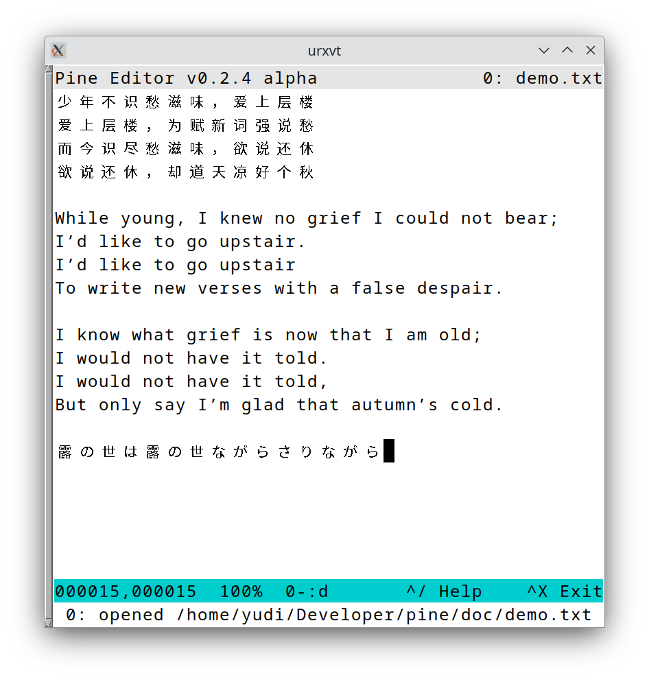
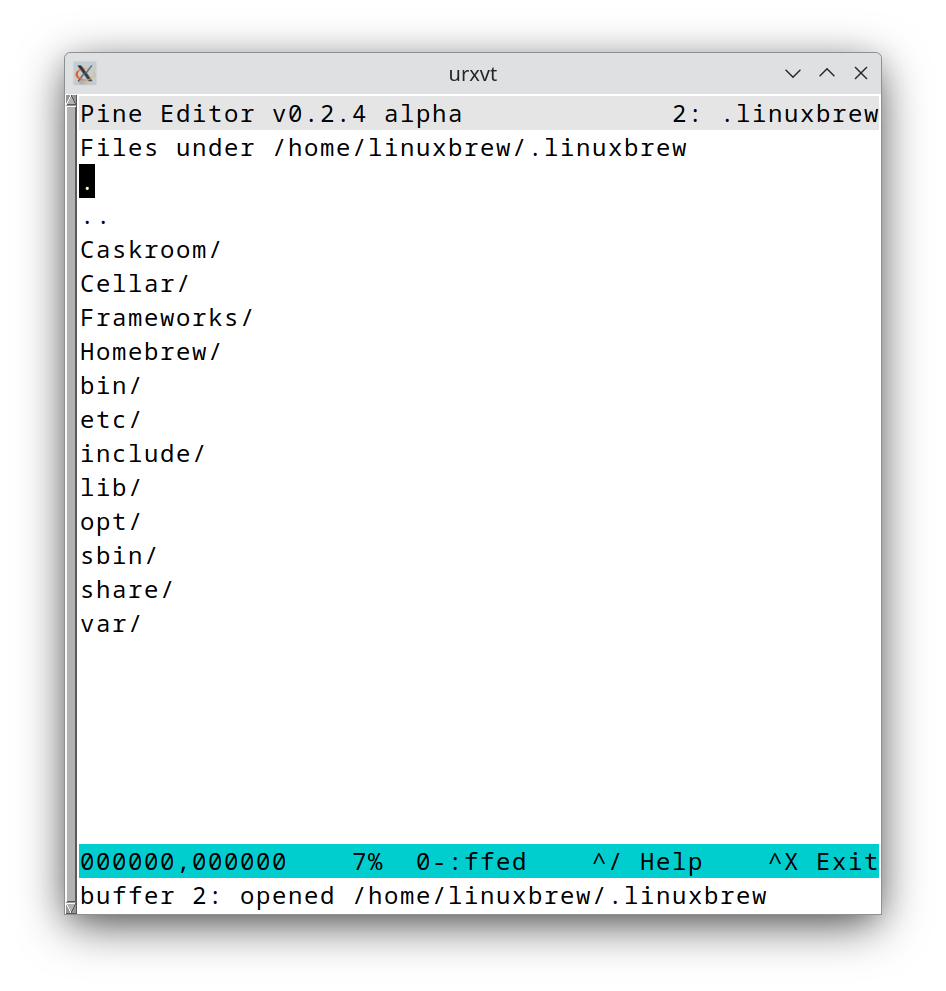

# (P)ine (I)s (N)ot (E)ditor

Pine is a terminal editor. It is inspired by [uemacs](https://github.com/torvalds/uemacs) and [nano](https://www.nano-editor.org/)

## Features

It has a very simple and retro editing style, yet I add few modern features to smooth your experience.

* Native UTF-8 characters: you can type and view Chinese, Japanese, Arabic and other language characters.
* Modern style horizontal scrolling
* Mouse support for navigating the content
* Dir Mode to explore directory within the editor
* Buffer management

## Basic Keymapping

See [help doc](./doc/help.txt)

Ctrl X + Ctrl X to exit the editor

## Roadmap

- [x] Mouse support for scrolling and moving the cursor
- [x] Multiple buffers
- [x] Directory Mode
- [ ] Wrap the line
- [x] Auto indention
- [ ] Copy and paste within the editor
- [ ] Undo
- [x] Search text

## Install

`golang` is the only requirement.

run `make tools` and `make all`

move compiled binary file `pe` to any directory you prefer, e.g. `/usr/local/bin` and include in the `PATH`

## Usage

To open a file, run `pe /path/to/file`

To explore files, run `pe /path/to/directory/`

## Screenshots

