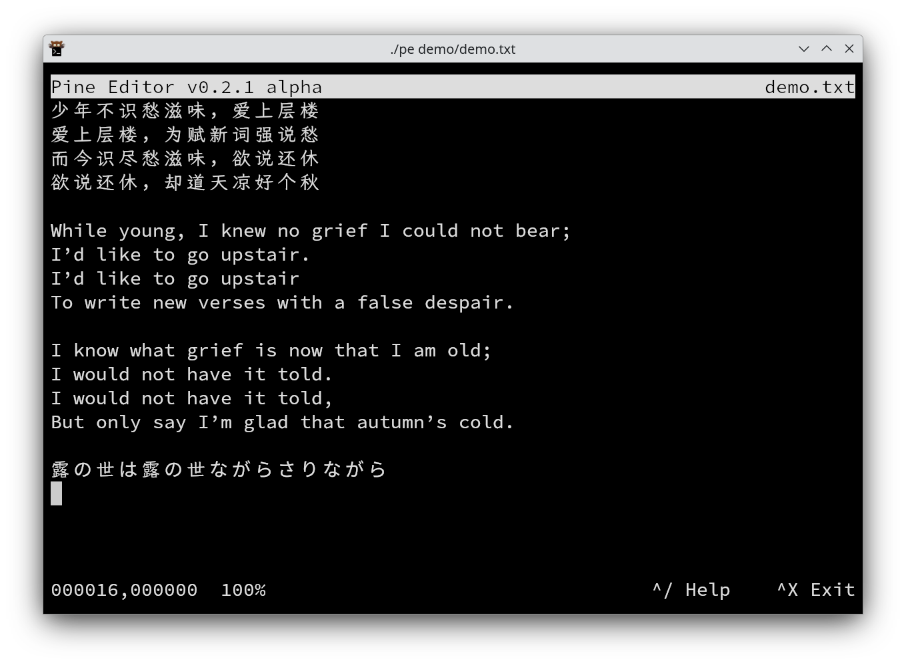

# (P)ine (I)s (N)ot (E)ditor

Pine is a terminal editor. It is inspired by [uemacs](https://github.com/torvalds/uemacs) and [nano](https://www.nano-editor.org/)

## Features

It has a very simple and retro editing style, yet I add few modern features to smooth your experience.

* Native UTF-8 characters: you can type and view Chinese, Japanese, Arabic and other language characters.
* Scroll: you can scroll file left-right and up-down if your terminal cannot fit all its content.
* Open and save files

## Roadmap

* Multiple buffers
* Wrap the line
* Auto indention
* Mouse support for scrolling and moving the cursor
* Copy and paste within the editor
* Undo
* Search text

## Install

`golang` is the only requirement.

run `make build`

move compiled binary file `pine` to any directory you prefer, e.g. `/usr/local/bin` and include in the `PATH`

## Usage

To open a file run `pine /path/to/file`

